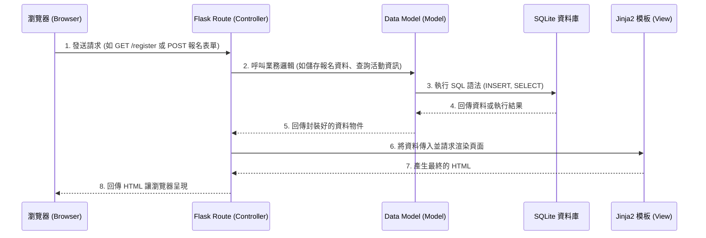

# 系統架構文件 (Architecture)

## 1. 技術架構說明

本專案採用典型的單體式架構 (Monolithic Architecture) 搭配伺服器端渲染 (Server-Side Rendering, SSR)，以滿足快速開發與部署 MVP 的需求。

### 選用技術與原因
- **後端 (Backend)**: Python 搭配 **Flask** 框架。Flask 屬於輕量級框架，能夠快速搭建具備路由與核心邏輯的應用服務，非常適合用來建立活動報名系統的 MVP 版本。
- **資料庫 (Database)**: **SQLite**。其無伺服器 (Serverless) 的特性與輕巧性，能夠將資料庫封裝成單一檔案，降低初期設定與維護成本。
- **前端渲染 (Frontend)**: **Jinja2** 搭配基本的 HTML/CSS/JS。避免初期投入大量心力在前後端分離上，可以透過 Flask 內部直接渲染出頁面，確保最快的開發節奏。

### Flask MVC 模式說明
在我們的 Flask 專案中，我們採用類似 MVC (Model-View-Controller) 的設計模式來分離職責：
- **Model (模型)**：負責與 SQLite 資料庫溝通，封裝資料庫查詢與更新邏輯（例如：讀取活動行程、新增報名者、更新繳費狀態）。
- **View (視圖)**：由 Jinja2 HTML 模板負責。負責將後端傳來的資料（如報名名單、活動資訊）轉換為使用者可見的網頁介面。
- **Controller (控制器)**：由 Flask 的路由 (`@app.route`) 負責。處理來自瀏覽器的 HTTP 請求，執行商業邏輯（如驗證報名資料、統計人數），調用 Model 更新資料，最後將資料傳遞給 View 進行渲染。

## 2. 專案資料夾結構

本專案建議採用模組化的結構，將不同的職責分開，確保後續擴充與維護的便利性：

```text
web_app_development/
├── app/
│   ├── __init__.py      # 初始化 Flask 應用程式
│   ├── models/          # 存放資料庫操作與模型定義 (例如 db.py, event.py, registration.py)
│   ├── routes/          # 存放所有的路由控制器 (例如 main.py, admin.py)
│   ├── templates/       # 存放所有 Jinja2 HTML 模板 (例如 index.html, register.html, dashboard.html)
│   └── static/          # 存放 CSS、JavaScript 檔案與圖片等靜態資源
├── instance/
│   └── database.db      # SQLite 資料庫檔案，通常不加入版本控制
├── docs/                # 存放專案說明文件 (PRD, ARCHITECTURE 等)
├── app.py               # 專案啟動入口 (負責運行 app.run)
└── requirements.txt     # Python 依賴套件清單
```

## 3. 元件關係圖

透過以下的流程圖，我們可以清楚看到使用者發出請求後，系統內部各元件如何協作：



## 4. 關鍵設計決策

1. **不採用前後端分離 (SPA)，改用伺服器端渲染 (SSR)**
   - **原因**：為了在最短時間內推出 MVP 驗證市場需求。使用 Vue/React 會增加 API 開發成本與狀態管理的複雜度，而 Jinja2 能快速達成畫面與資料的綁定。
2. **將路由 (Routes) 與模型 (Models) 分離**
   - **原因**：避免將所有的 SQL 查詢與商業邏輯全部塞在 `app.py` 中。分離後，路由層只需要專注處理 HTTP 請求與回應，資料庫操作全部交由 models 層處理，大幅提升程式碼的可讀性與可維護性。
3. **選擇 SQLite 作為初始資料庫**
   - **原因**：活動報名系統在初期不會面臨極端高併發寫入的挑戰，且資料結構相對單純。SQLite 能滿足基本需求，並免除安裝與設定 PostgreSQL/MySQL 的時間。若未來流量擴大，只要在 Model 層調整，即可無痛轉移至其他關聯式資料庫。
4. **將資料庫檔案獨立於 `instance/` 資料夾**
   - **原因**：保護真實營運資料。`instance/` 可以被加入 `.gitignore`，確保包含使用者個資與報名狀態的資料庫檔案不會被推送到公開或共享的 Git 儲存庫中。
