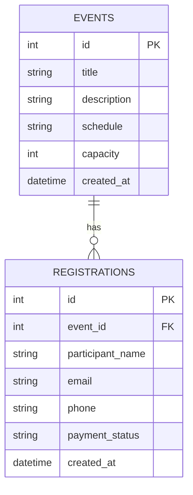

# 資料庫設計文件 (DB Design)

## 1. ER 圖（實體關係圖）

## 2. 資料表詳細說明

### EVENTS (活動表)
儲存主辦方建立的活動資訊。
- `id` (INTEGER, PK): 活動唯一識別碼，自動遞增。
- `title` (TEXT, 必填): 活動名稱。
- `description` (TEXT, 選填): 活動詳細描述。
- `schedule` (TEXT, 必填): 活動行程表。
- `capacity` (INTEGER, 必填): 活動人數上限，用來控制報名人數。
- `created_at` (DATETIME, 必填): 建立時間。預設為當前時間。

### REGISTRATIONS (報名表)
儲存參加者的報名資料與繳費狀態。
- `id` (INTEGER, PK): 報名紀錄唯一識別碼，自動遞增。
- `event_id` (INTEGER, FK, 必填): 關聯到 `EVENTS` 表的 `id`，代表報名了哪一場活動。
- `participant_name` (TEXT, 必填): 參加者姓名。
- `email` (TEXT, 必填): 聯絡信箱。
- `phone` (TEXT, 必填): 聯絡電話。
- `payment_status` (TEXT, 必填): 繳費狀態（例如：'unpaid' 未繳費, 'paid' 已繳費）。預設為 'unpaid'。
- `created_at` (DATETIME, 必填): 報名時間。預設為當前時間。

## 3. SQL 建表語法
請參考專案中的 `database/schema.sql` 檔案。

## 4. Python Model 程式碼
請參考專案中的 `app/models/` 資料夾，包含：
- `db.py`: 管理 SQLite 連線與初始化 DB 的共用邏輯。
- `event.py`: 實作 Event 的 CRUD。
- `registration.py`: 實作 Registration 的 CRUD 以及人數統計功能。
